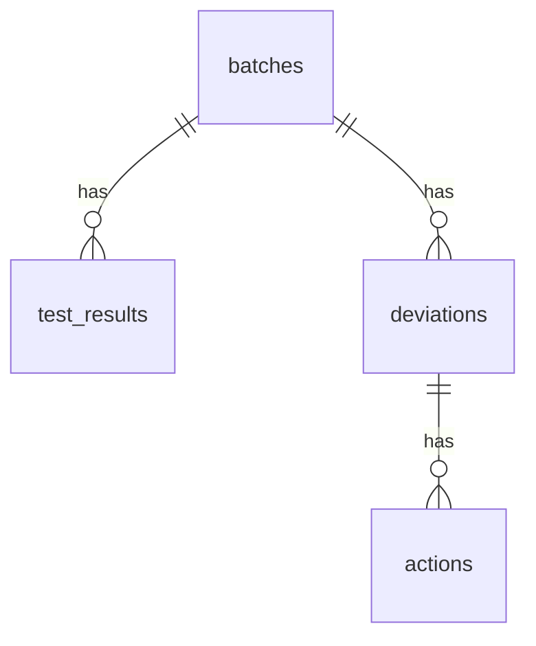

# BatchScope

**Pharmaceutical Quality Operations Analytics**

[](https://github.com/rayexzh/batchscope/actions/workflows/tests.yml)

[中文说明](README.zh-CN.md) · **Local desktop prototype · v0.5.0-alpha.1 · synthetic data only**

A small pharmaceutical quality-operations portfolio project that links batches, measurements, deviations and actions in SQLite. It answers three questions using an explicit **as-of date**:

1. Which measurements fall outside fictional configured ranges?
2. Where are deviations still open, and how old is the backlog?
3. Which outstanding actions are past their due date?

This project demonstrates domain-aware data modelling, Python input validation, SQL JOINs/CTEs/window functions and metric interpretation. It is an independent educational prototype, with no claimed employer deployment or regulatory validation.

**BatchScope** combines **batch** traceability with a **scope** for reviewing quality records. It is a standalone desktop project, maintained separately from [RxDataLint](https://github.com/rayexzh/rx-data-lint). RxDataLint checks NHS medicines data; BatchScope reviews fictional manufacturing-quality workflows. Each has its own repository, versions and issue tracking.


## Run the desktop program

**Without Python (Windows x64):** download the portable ZIP from [Releases](https://github.com/rayexzh/batchscope/releases), extract it completely, and double-click **BatchScope.exe**. No Python installation or paid API is needed. Generated data and results persist in `%LOCALAPPDATA%\BatchScope\outputs`, independently of the bundled resource/extraction directory. The executable is unsigned; SHA-256 checksums are provided with the release.

**From source:**

Requires Python 3.10+ with Tkinter, SQLite 3.25+ (normally bundled with official Python), and no third-party runtime packages. Source-mode outputs stay under the project `outputs/` directory.

- Open this folder as a project in PyCharm, then run the root **app.py** file.
- Alternatively, double-click **run_desktop.bat** if `python` is available on PATH.
- Click **Generate**, leave the example date at **2026-06-30**, then click **Analyse**.
- Inspect the three tabs and open the results folder. Each run uses a new folder under `outputs/`; earlier runs are preserved.
- Double-click a table row, or select it and click **Details**, to inspect the underlying records. Detail windows support status filters and record/batch searches; headings explain the fields in Chinese and English.

Measurement groups retain in-range, out-of-range and missing records. Deviation groups retain both open and closed records at the snapshot date. Overdue-action details include the related batch and source dates. Filtered visible counts are displayed alongside whole-group counts.

Details use the completed run's date and data. Editing the date or input files does not change an existing view; rerun to create another snapshot. Source closure/completion dates may be later than the snapshot, while the as-of status remains open/outstanding.

### Interface controls

- Switch the UI with **English / 中文**; open detail windows update while preserving filters and selections. Source product/method names and data stay unchanged.
- Choose a light blue-grey or dark blue theme and adjust text using **A− / A+**. Direct Windows launch enables DPI awareness; other scale factors and multiple monitors still need real-machine checks.
- Right-click a row for details, copying with headers, or copying its identifier/product name. Detail tables support copying. Right-clicking blank space does not act on a previously selected row.
- Click headings to sort numbers/text; unavailable values remain last. **Ctrl+C** copies the selected row; **Enter** opens details from summary rows.
- Key findings appear before secondary columns. Metric cards reflow when the window is narrow; scroll the page to reach lower controls with larger fonts. Activity bars disappear after processing.

See [interface guide and previews](docs/INTERFACE.md). Display settings do not change analysis or export contents.

### Quality review workbench

After analysing, click **Quality review workbench**. Three views help review outstanding actions and backlog:

- **Action follow-up:** overdue, due today, due in the next 1–7 days, and later actions. The default filter shows overdue/near-due items. A separate filter identifies outstanding actions whose parent deviation is closed; this is a follow-up prompt, not an automatic compliance finding.
- **Backlog age:** open deviations grouped by product/category into example 0–7, 8–30, 31–60 and 61+ day bands. Each group's bands reconcile with its open count.
- **Monthly movements:** up to 12 months of opening backlog, openings, closures and ending backlog. Each period reconciles `opening + opened − closed = ending`; the last period ends at the as-of date, even mid-month.

Select an action and open **Batch overview**, or choose a batch ID. This traces its measurements, deviations and **all** actions visible at the stored snapshot, including completed actions. Search and language/theme switching preserve the snapshot.

**Open review report** opens a standalone bilingual `QUALITY_REVIEW.html` with the queue, age groups, monthly chart, reconciliation table and input fingerprints. The report is an offline export, not a hosted application; no external assets or model API are used. Three additional CSVs are hashed with the completed run. A comparison run places these end-date outputs in `end_snapshot/`.

The [design rationale and rules](docs/QUALITY_REVIEW.md) explain the industry reference and the deliberately limited claims.

### Compare two dates

Use one input folder. Set **As of** to `2026-07-31`, **Compare from** to `2026-06-30`, then click **3. Compare dates**. You do not need to run the single-date analysis first. A separate window shows six start/end metrics and net changes, deviation movements, overdue-action movements and new measurements. The main window shows the end-date snapshot.

Search by ID, batch, product or movement. **Changed records only** hides continuing open/overdue records; uncheck to review the whole movement list. Metrics retain zero changes. Sorting, copying, theme and language switching work here too. Scroll vertically for larger fonts and horizontally for additional columns. **View comparison** reopens the completed comparison; changing input/date controls does not modify old windows.

Both dates use one validated SQLite snapshot; input files are read once. Outputs include four comparison CSVs (headers retained even when empty), `COMPARISON.json`, `COMPARISON.md`, `START_SNAPSHOT.json`, the full `end_snapshot/`, and a parent `manifest.json` covering nested output hashes. Same-day comparisons give zero net changes. Reversed or invalid dates block the comparison. A failed run may leave diagnostic/partial output; only a parent completion manifest indicates a completed comparison.

This compares endpoint states, not edits or all events during an interval. A deviation opened and closed between the dates is listed separately and does not increase the ending backlog. An action that became overdue and was completed wholly between endpoints is absent from the endpoint overdue movements. Closure of a deviation does not automatically mean its actions are completed.

See the [worked business case](docs/CASE_STUDY.md) and [date-comparison guide](docs/COMPARISON.md).

The program never uploads inputs. `SOURCE.json` must explicitly label inputs as synthetic; the marker is a declaration, not independent proof of data origin. Use the supplied fictional generator; do not import confidential company records.

## Reproduce from the command line

Run from this project folder:

```powershell
python quality_ops.py generate outputs/new-input --seed 42 --batches 100
python quality_ops.py analyse outputs/new-input outputs/new-review --as-of 2026-06-30
python comparison.py outputs/new-input outputs/new-comparison --from 2026-06-30 --to 2026-07-31
python -m unittest discover -v
```

Choose new input/output paths if those folders already exist. The included `examples/synthetic-v1` contains 100 batches, 200 measurements, 33 deviations and 66 actions. Two measurements occur in July, so the June snapshot correctly includes **198**, not 200.

| June 30 demo metric | Expected result |
|---|---:|
| Measurement records in scope | 198 |
| Judgeable measurement records | 184 |
| Missing measurements | 14 |
| Outside fictional ranges | 74 |
| Open deviations | 22 |
| Overdue outstanding actions | 30 |

These frequencies are generated demonstration scenarios; they are not estimates of pharmaceutical industry performance.

## Model and metric rules



- Missing measurements remain SQL NULL, never zero. Range-rate denominators include only present, valid measurements. A group with no judgeable results has no rate.
- Values exactly on either bound are inside the configured range. Results are grouped by product, test, method, unit **and both bounds**, so incompatible definitions are not pooled.
- Manufacture, measurement, deviation-opening and action-creation dates must be on/before the snapshot to enter the relevant analysis. A closure or completion after that date remains open at that date.
- An outstanding action is overdue only when `due_on < as_of`. Due today is not overdue. `review_order` ranks by lateness, not quality risk or staff performance.
- Invalid dates/numbers, duplicate IDs, orphan links, reversed timelines, reversed bounds and mismatched units block analysis. `INPUT_ISSUES.csv` explains the issues; no completion manifest is written.

See [DATA_DICTIONARY.md](DATA_DICTIONARY.md), [schema.sql](schema.sql), [summary SQL queries](sql), and [detail SQL queries](detail_sql). Successful output includes SQLite, three CSV summaries, three detail CSVs, JSON metrics, a bilingual Markdown summary and a completion manifest with SHA-256 hashes. CSV text that resembles a spreadsheet formula is escaped; JSON/SQLite retain source text. A hash manifest detects differences relative to its recorded hashes; it is not a digital signature or GMP audit trail.

## Validation and current limits

43 automated tests cover the existing calculations and interfaces plus work queues, the 7-day boundary, age-band boundaries, monthly stock/flow reconciliation, partial months, older carryover, batch tracing, HTML escaping and persistent packaged output paths. Release smoke-test evidence is provided separately; neither tests nor EXE packaging constitute regulated-system validation.

This is a first local prototype. There is no external-user validation, automatic unit conversion, risk prediction, CAPA effectiveness assessment, access-control system or electronic signature. Historical views use dates in the supplied snapshot; they do not reconstruct edits, reopened deviations or backdated corrections. SQLite REAL numbers are approximate. Inputs are held in memory and the desktop table displays all summary rows, so large datasets are outside the current validated scope.

Fictional specifications and automated range flags **do not constitute OOS investigation conclusions, regulatory limits or batch-release decisions**. This software has not undergone regulated-system CSV/GMP validation.

## Next useful work

Have a domain reviewer inspect one scenario, document corrections, then add one justified workflow improvement. Practise explaining the three SQL queries and their denominators independently. Additional dashboards or AI features come after the metrics and user need are established.

See [CONTRIBUTING.md](CONTRIBUTING.md) to report a reproducible problem or suggest a domain review.

Build instructions and packaged-EXE checks are in [WINDOWS_BUILD.md](docs/WINDOWS_BUILD.md).
