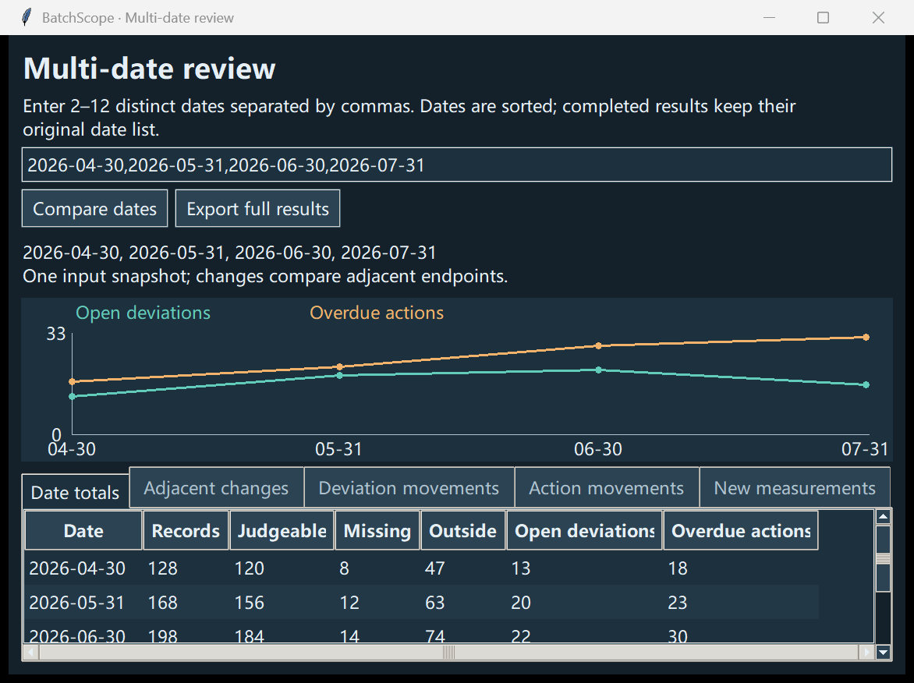

# BatchScope

用模拟数据复核批次质量记录与审计日志，支持多个日期的对比。

Review synthetic batch records and audit logs. Compare their changes across dates. [Full English README](README.md)

[下载 Windows 版](https://github.com/rayexzh/batchscope/releases/tag/v0.6.0-alpha.2) · [78 秒动画](https://github.com/rayexzh/batchscope/releases/download/v0.6.0-alpha.1/BatchScope-Short-Explainer.mp4) · [文档目录](docs/INDEX.md)

**当前版本：v0.6.0-alpha.2。** 本地桌面演示程序，仅使用模拟数据。

## 解决什么问题

批次检验、偏差和后续措施相互关联，分开看几张表容易漏掉上下文。例如，偏差已经关闭，相关措施却未完成；用今天的状态回答“上月底积压多少”，也可能得到错误结果。

BatchScope 把这些记录关联起来，按指定的**截至日期**还原当时的状态。适合学习药品质量业务流程，也用于展示 Python 和 SQL 如何辅助记录复核。



## 能看什么

| 页面 | 回答的问题 |
|---|---|
| **检验范围** | 有效结果中哪些超出设定的模拟范围？哪些结果缺失？ |
| **偏差积压** | 指定日期还有哪些偏差未关闭？已经积压多久？ |
| **措施跟进** | 哪些未完成措施已逾期？对应什么批次和偏差？ |
| **日期对比** | 2–12 个日期的数量怎样变化？相邻日期之间哪些记录发生变化？ |
| **审计日志复核** | 哪些操作缺少原因、不符合配置权限，或存在时间异常？ |

打开记录后，可以沿关联查看批次、检验、偏差和措施。表格支持搜索、排序和复制；界面支持中英文切换、主题和字号调整。

审计示例有 6 条事件，产生 6 个检查项，涉及 4 条事件。打开检查项可查看原始操作和规则配置，也能查看对应批次。时间线按 UTC 操作日期统计，无效时间戳单列。标记只提示复核，不判定违规。

每条检查项可填写处理状态和理由。备注单独保存，重新打开相同日志与配置时恢复，并进入完整导出。历史版本保留，不删除原始检查项。

## 先用内置示例试一次

1. 下载 Windows ZIP，**完整解压**，双击 **BatchScope.exe**。不需要安装 Python。
2. 点击 **生成演示数据**。
3. 截至日期填 **2026-06-30**，点击 **运行分析**。
4. 打开一条记录，追溯到对应批次。
5. 打开 **多日期对比**，比较几个日期；原有两日期对比也保留。
6. 打开 **审计日志复核**，生成模拟日志，查看一条检查结果。

默认示例的结果：

| 指标 | 6 月 30 日 | 7 月 31 日 |
|---|---:|---:|
| 未关闭偏差 | 22 | 17 |
| 逾期措施 | 30 | 33 |

未关闭偏差减少，逾期措施却增加：期间有 4 项措施开始逾期，1 项解除逾期。对比页面会列出变化来源，而不只显示两个总数。这些数值是为演示设计的，不代表真实企业表现。

修改日期或输入文件夹后，需要重新运行。旧结果仍属于原来的快照，不会随着输入框自动变化。

## 输入和输出

示例生成器创建 `batches.csv`、`test_results.csv`、`deviations.csv`、`actions.csv`，并附上 `SOURCE.json` 数据声明。字段与关联见[数据字典](DATA_DICTIONARY.md)。

每次成功运行会生成 SQLite 数据库、CSV 汇总和明细、离线报告及运行元数据。Windows 版把数据和结果保存在 `%LOCALAPPDATA%\BatchScope\outputs`，不需要付费 API。

## 使用边界

检验范围是模拟设定。超范围或逾期只是复核线索，不能据此判定根因、认证合规或放行批次。程序没有电子签名或生产环境权限管理，不能替代经过验证的药企质量管理系统。

Windows 程序未签名。已有测试和脚本化试用记录，但没有声称真实企业部署或老师背书。详见[质量复核说明](docs/QUALITY_REVIEW.md)和[脚本化试用记录](docs/SIMULATED-USABILITY-REVIEW.md)。

## 从源码运行

使用带 Tkinter 的 Python 3.10 或以上版本，在项目根目录运行：

```powershell
python app.py
```

命令行生成和分析方法见[启动指南](docs/QUICKSTART.md)及项目文档。核心程序使用 Python 标准库和 SQLite。

## 更多资料

- [审计日志与规则配置](docs/AUDIT_TRAIL.md)
- [复核备注与处理状态](docs/REVIEW_NOTES.md)
- [多日期对比](docs/MULTI_DATE.md)
- [日期对比](docs/COMPARISON.md)、[界面操作](docs/INTERFACE.md)
- [业务示例](BUSINESS_BRIEF.md)、[SQL 案例](docs/CASE_STUDY.md)
- [更新记录](CHANGELOG.md)、[贡献说明](CONTRIBUTING.md)
- [短动画](docs/SHORT_DEMO.md)与[旧版操作演示](docs/DEMO_VIDEO.md)：均使用合成旁白。

软件采用 [MIT 许可证](LICENSE)。[RxDataLint](https://github.com/rayexzh/rx-data-lint) 是独立维护的 NHS 药品 CSV 检查项目，运行 BatchScope 不需要它。
