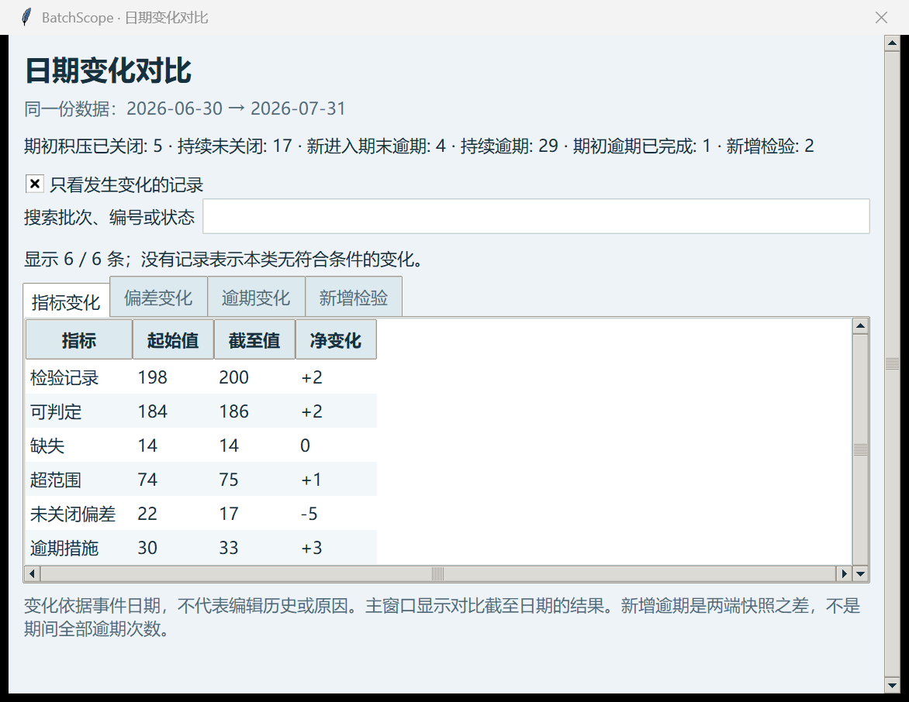

# BatchScope · 批次质量洞察

**药企质量运营分析桌面程序**

[](https://github.com/rayexzh/batchscope/actions/workflows/tests.yml)

[English](README.md) · **本地桌面原型 · v0.5.0-alpha.2 · 仅模拟数据**

这个项目把你的“药品质量与安全 + 数据能力”连接起来：用 Python 检查输入，SQLite 建立四表关系，再通过 SQL 回答三个具体问题。

1. 哪些检验结果超出设定的**虚构示例范围**？
2. 哪些偏差还没关闭，积压了多久？
3. 截至某个日期，哪些措施已经逾期？

它是独立的学习与作品集原型，目前没有真实药企部署、行业用户认可或合规验证的证明。

**BatchScope** 由 Batch（批次）与 Scope（观察、审视的范围）组成，表示透过数据查看批次相关的质量记录。它与 [RxDataLint](https://github.com/rayexzh/rx-data-lint) 独立维护：RxDataLint 检查 NHS 药品数据质量，BatchScope 分析虚构药企的质量业务流程。两者使用各自的仓库、版本与问题反馈。



## 怎么打开

**不安装 Python（Windows 64 位）：**从 [Releases](https://github.com/rayexzh/batchscope/releases) 下载便携 ZIP，完整解压，双击 **BatchScope.exe**。无需 Python 或付费 API。生成的数据与结果保存到 `%LOCALAPPDATA%\BatchScope\outputs`，不写入程序的临时解压目录。本版本 EXE 未做数字签名，发布页提供 SHA-256 校验文件。

**从源码运行：**

需要 Python 3.10 或以上及 Tkinter；不需安装额外运行时包。源码方式的输出仍保存在项目 `outputs/` 下。

1. 在 PyCharm 中打开这个项目文件夹。
2. 打开根目录的 **app.py**，右键运行。
3. 点击 **① 生成演示数据**。
4. 日期先保持 **2026-06-30**，点击 **② 运行分析**。
5. 查看三个标签页：检验范围、偏差积压、逾期措施。点击“打开结果文件夹”查看摘要与导出表。
6. **双击表格中的一行**，或选中后点击“查看选中记录”，查看对应批次与记录。

明细窗口可以按状态筛选，也可以搜索批次、检验编号、偏差编号或措施编号。表头显示中英文含义；“显示数量”是当前筛选结果，“整组数量”用于对照主表汇总。

### 界面设置与表格操作

- 顶部 **English / 中文** 按钮切换界面语言；已打开的明细同步更新，筛选和选中记录保留。产品、方法名称及原始数据不翻译、不修改。
- **深色模式 / 浅色模式** 切换浅蓝灰与深蓝主题；**A− / A+** 调整字体大小。Windows 直接运行入口时启用 DPI 适配；其他缩放比例和多显示器环境仍需要用户实机检查。
- **右键点击某一行**：汇总表可以查看明细、复制行（含表头）、复制编号或产品名；明细表提供复制操作。空白处右键不会作用于旧的选中记录。
- 点击列名按数值或文本排序；缺失值保持在末尾。选中行后也可以使用 **Ctrl+C** 复制，汇总表按 **Enter** 打开明细。
- 关键异常数与比例在表格前部；六个指标卡片展示当前结果。较窄窗口或较大字体下指标换行，页面右侧滚动条可以访问下方功能。
- 进度条只在分析时显示。界面文字切换不会改变结果、输入或导出语言口径。

界面示例和操作说明见 [INTERFACE.md](docs/INTERFACE.md)。

### 质量复核工作台

分析后点击 **质量复核工作台**，可以查看：

- **措施跟进**：逾期、今天到期、1–7 天内到期与更晚到期的未完成措施。默认显示逾期及近期到期项；另可筛选“偏差已关闭，措施未完成”，这仅提示跟进，不自动判定违规。
- **积压分布**：按产品与偏差类别，将未关闭偏差分为 0–7、8–30、31–60、61 天以上的示例分段；分段数量与组内未关闭数一致。
- **月度变化**：最多 12 个月的期初积压、开启、关闭与期末积压，逐期核对“期初＋开启－关闭＝期末”；最后一期截至分析日期，可以是不完整月份。

选中措施后打开 **批次全景**，或从列表选择批次编号，联查检验、偏差与该日期可见的**全部措施**，包括已完成项。语言、主题与搜索不会修改快照。

**打开复核报告** 可以查看独立双语 `QUALITY_REVIEW.html`，包含工作列表、积压分段、月度图表、对账和输入文件指纹。这是离线导出报告，不是托管网页，不调用外部资源或模型 API。每次分析还会导出三个复核 CSV 并记录哈希；日期对比中的截至日期报告位于 `end_snapshot/`。

行业参考与口径见 [质量复核设计说明](docs/QUALITY_REVIEW.md)。

### 两个日期的变化对比

选择同一份输入数据，将上方 **截至日期** 设为 `2026-07-31`，下方 **对比起始日期** 设为 `2026-06-30`，点击 **③ 对比两个日期**。不需要先运行单日期分析。

独立窗口展示六个指标的起始值、截至值与净变化，以及偏差变化、逾期变化和新增检验。主窗口同步显示截至日期的快照。可以搜索编号、批次、产品或变化类型；取消“只看发生变化的记录”可以查看持续未关闭和持续逾期的记录。指标表始终保留零变化项。对比表支持排序、复制、语言与主题切换；大字体可滚动页面，横向滚动可查看更多列。

**查看已有对比** 可以重新打开结果；修改日期或输入不会改变旧窗口。程序只读取和校验一次输入，两端都使用同一份 SQLite 快照。相同日期净变化为零；日期反转或无效会阻止运行。

输出包含四个对比 CSV（无记录时也有表头）、`COMPARISON.json`、双语 `COMPARISON.md`、起始快照 `START_SNAPSHOT.json`、完整的截至日期快照 `end_snapshot/`，以及核对嵌套输出文件哈希的 `manifest.json`。失败时可能保留诊断或部分文件，只有最外层完成清单存在才代表整个对比完成。

这不是编辑审计历史，也不是期间所有事件的统计。期间开启并关闭的偏差单独列出，不增加期末积压；期间曾逾期但在期末前完成的措施，如果两端都不在逾期列表中，就不会出现在逾期变化列表。偏差关闭也不自动代表关联措施完成。

操作与截图见 [日期对比说明](docs/COMPARISON.md)，面试讲解可参考 [业务案例](docs/CASE_STUDY.md)。

检验组明细保留范围内、超范围及缺失的所有组内记录；偏差组明细同时保留截至日期时的已关闭和未关闭记录。逾期措施明细增加关联批次、创建日期和源完成日期。

**明细使用已经完成的那次分析日期。** 修改主窗口日期后，需要重新运行才会生成新快照；打开的旧明细不会随输入文件或主窗口日期改变。源关闭/完成日期可晚于快照日期，此时截至日期状态仍是未关闭/未完成。

如果电脑可以直接使用 `python` 命令，也可以双击 **run_desktop.bat**。每次运行都会在 `outputs` 中创建新目录，保留历史结果。程序在本地处理，不上传输入。

## 演示数据与预期结果

`examples/synthetic-v1` 中有 100 个虚构批次、200 条检验记录、33 条偏差、66 条措施。产品、方法和范围都是示例，不取自真实企业。

截至 2026-06-30：

| 指标 | 预期结果 |
|---|---:|
| 日期范围内检验记录 | 198 |
| 可判定记录 | 184 |
| 缺失检验值 | 14 |
| 超出示例范围 | 74 |
| 未关闭偏差 | 22 |
| 未完成且逾期的措施 | 30 |

另外 2 条检验记录发生在 7 月，因此不进入 6 月快照。这里的异常频率是人为模拟场景，不代表药企实际质量水平。

命令行复现，选择尚不存在的目录：

```powershell
python quality_ops.py generate outputs/new-input --seed 42 --batches 100
python quality_ops.py analyse outputs/new-input outputs/new-review --as-of 2026-06-30
python comparison.py outputs/new-input outputs/new-comparison --from 2026-06-30 --to 2026-07-31
python -m unittest discover -v
```

## 统计口径为什么重要

- 缺失检验值保留为 NULL，不按零计算，不进入范围异常率分母；全部缺失时，异常率不可用。
- 等于上下限的值算范围内。按产品、检验项目、方法、单位及上下限分组，避免合并不同标准。
- 指定日期之后才发生的检验、偏差或措施不计入；之后才关闭或完成的记录，在指定日期仍算未完成。
- 今天到期不算逾期；排序只表示逾期天数，不代表质量风险排名或员工绩效。
- 重复编号、孤立外键、无效日期或数字、前后日期矛盾、上下限反转、单位不一致都会阻止分析，生成 `INPUT_ISSUES.csv`；不会生成完成清单。

输出包括 SQLite 数据库、三个 SQL 汇总 CSV、三个记录明细 CSV、JSON 指标、双语 Markdown 摘要及记录文件哈希的完成清单。哈希只能核对与清单是否一致，不是签名或 GMP 审计追踪。数据声明 `SOURCE.json` 必须标注 synthetic，但该声明不是独立的数据来源认证。

43 项测试覆盖原有计算与界面，以及措施状态、7 天边界、积压分段边界、月度存量对账、不完整月份、跨年积压、批次联查、HTML 转义与 EXE 持久输出路径。打包 EXE 的运行证据单独提供；测试或打包本身不代表受监管系统验证。

## 当前边界与后续方向

目前不支持自动单位转换、真实 CAPA 有效性评价、风险预测、电子签名或权限管理；未做外部用户验收。历史快照依据输入文件中的日期，不能重建编辑记录、重新打开偏差或事后补录的完整历史。

**超范围标记只是复核提示，不代表 OOS 调查结论、法规标准、批次放行或经过 CSV/GMP 验证的软件。**

下一步先让老师或熟悉质量业务的人检查一个示例场景，记录反馈。你自己练习讲解 SQL 的 JOIN、CTE、窗口函数以及分母口径，再按反馈扩展一个有用功能。

反馈与贡献方式见 [CONTRIBUTING.md](CONTRIBUTING.md)。

打包与 EXE 验证步骤见 [WINDOWS_BUILD.md](docs/WINDOWS_BUILD.md)。
