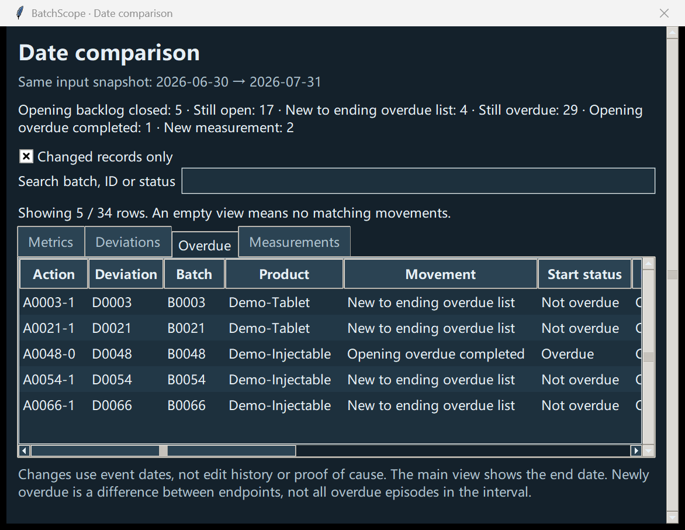

# Date comparison / 日期对比

## Run / 操作

1. Generate or select the synthetic input folder. / 生成或选择模拟输入文件夹。
2. Set the upper **As of / 截至日期** to `2026-07-31`.
3. Set **Compare from / 对比起始日期** to `2026-06-30`.
4. Click **Compare dates / 对比两个日期**. Single-date analysis is not a prerequisite. / 不需要先运行单日期分析。
5. Review the separate window and the output folder. / 查看独立对比窗口与结果文件夹。

Numbers are from the fictional 100-batch dataset. / 数值来自 100 批次虚构数据。

## Reading the results / 如何解释

- **Metrics / 指标**: ending minus starting counts. Positive changes are not automatically worse; an increased measurement count usually reflects additional dated records. / 净变化是截至值减起始值，增加不自动代表变差，检验记录增加可能只是日期内记录变多。
- **Deviations / 偏差**: opening backlog closed, opened and still open, opened and closed within the interval, or still open. Records already closed at the start are omitted. / 区分期初积压已关闭、期间开启仍未关闭、期间开启并关闭、持续未关闭；期初已经关闭的记录不列入变化。
- **Overdue / 逾期**: new to the ending overdue list, opening overdue completed, or still overdue. Due on an endpoint date is not overdue on that date. / 区分新进入期末逾期、期初逾期已完成、持续逾期；端点当天到期不算逾期。
- **Measurements / 检验**: records that entered scope after the start date, with their original values, method, units and example bounds. / 起始日期之后新进入范围的记录，保留原值、方法、单位与示例上下限。

The top movement totals describe the whole comparison; search and the checkbox affect only visible table rows. The metric table includes zero changes. / 顶部变化数量是完整对比的总量；搜索和勾选只影响表格显示，指标表包含零变化项。

## Reconciliation / 对账

`Ending open = Starting open + Opened and still open − Opening backlog closed`

`期末未关闭 = 期初未关闭 + 期间开启且仍未关闭 − 期初积压已关闭`

`Ending overdue = Starting overdue + New to ending overdue list − Opening overdue completed`

`期末逾期 = 期初逾期 + 新进入期末逾期 − 期初逾期已完成`

These equations use endpoint stocks. Newly overdue does not count episodes that started and ended wholly between the endpoints. The data model has no reopening or edit history. / 这些等式使用两端存量，不统计期间发生且已结束的全部逾期过程。数据模型没有重新开启或编辑历史。

## Review controls / 复核操作

Search batch IDs, record IDs, products or Chinese/English movement labels. Uncheck **Changed records only / 只看发生变化的记录** to include continuing items. Sort headings; right-click to copy a row or identifier. Switch language/theme from the main window; the old comparison retains its dates and data. Larger fonts can require page scrolling; wider records require horizontal scrolling. / 支持中英文搜索、持续记录显示、排序和复制；语言与主题从主窗口切换。旧对比固定保留日期和数据，大字体可滚动，宽表可横向滚动。

This is a synthetic portfolio demonstration, not a validated operational quality system. / 这是模拟作品集演示，不是经过验证的企业质量系统。
