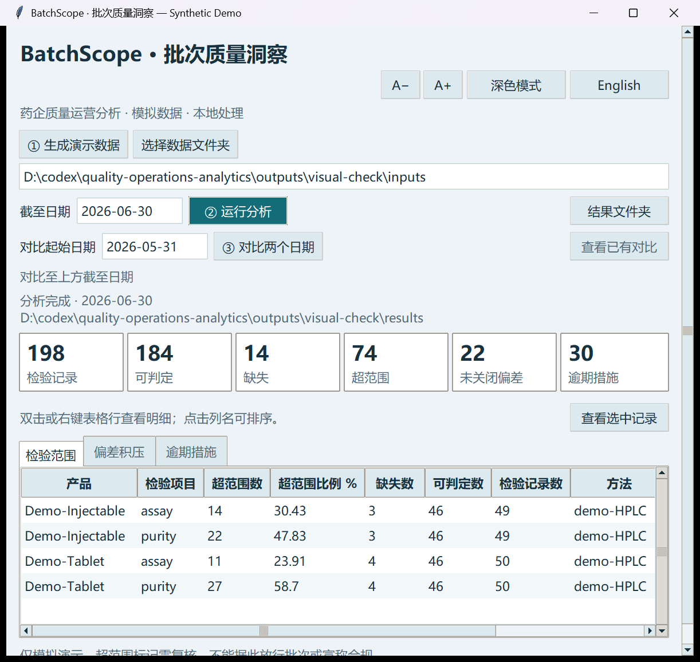
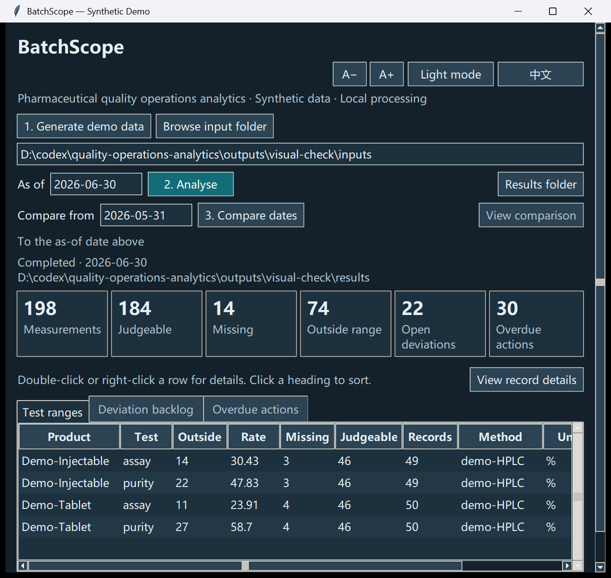

# Desktop interface / 桌面界面

The UI can display one language at a time. Display settings do not modify source data, calculations or completed output folders. This remains an independent synthetic-data prototype.

界面一次显示一种语言；切换语言、颜色和字号不会修改数据、统计结果或已完成输出。当前仍为独立模拟数据原型。

| Control / 操作 | Behaviour / 功能 |
|---|---|
| English / 中文 | Switch controls, headings, snapshot status and open details / 切换界面与已打开明细的文字 |
| Dark / Light mode | Apply the same palette to main window, details, menus and tables / 主窗口、明细、菜单和表格统一主题 |
| A− / A+ | Adjust native font sizes; scroll down when content exceeds the window / 调整字体，内容超出窗口时可向下滚动 |
| Right-click a row / 右键行 | Review or copy the clicked row; blank space produces no menu / 复核或复制点击的行，空白处不弹出菜单 |
| Click a heading / 点击列名 | Numeric/text ascending/descending sort; NULL last / 数值或文本排序，缺失值置后 |
| Ctrl+C / Enter | Copy selected row / Open summary record details / 复制选中行或打开汇总明细 |

Row copying produces TSV with headers. Formula-like text is escaped and embedded tabs/newlines are quoted; numeric negatives remain numbers. Copying an identifier returns the exact identifier text. Standard CSV exports remain complete and independent of displayed filters.

复制行时输出含表头的 TSV，转义公式形式文本并处理嵌入的制表符或换行，保留负数值。复制编号会返回原编号文本。完整 CSV 导出不受界面筛选影响。

## Light Chinese / 浅色中文

## Dark English / 深色英文

Screenshots show generated seed-42 data as of 2026-06-30. Native window capture inspected only this application's own window. Fonts use installed system families. DPI and layout results can vary across Windows versions, displays and scale factors.

截图展示固定种子 42、截至 2026-06-30 的模拟数据。截图仅包含本测试程序窗口。字体取自系统已安装字体；不同电脑、显示器和缩放设置的效果仍需要实机检查。
