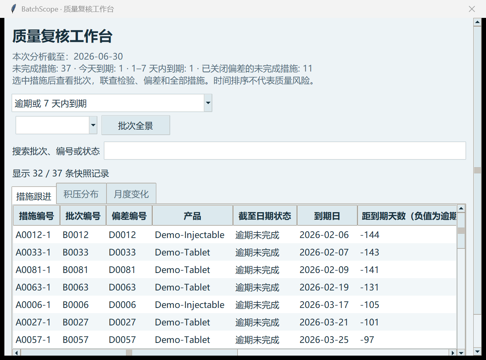
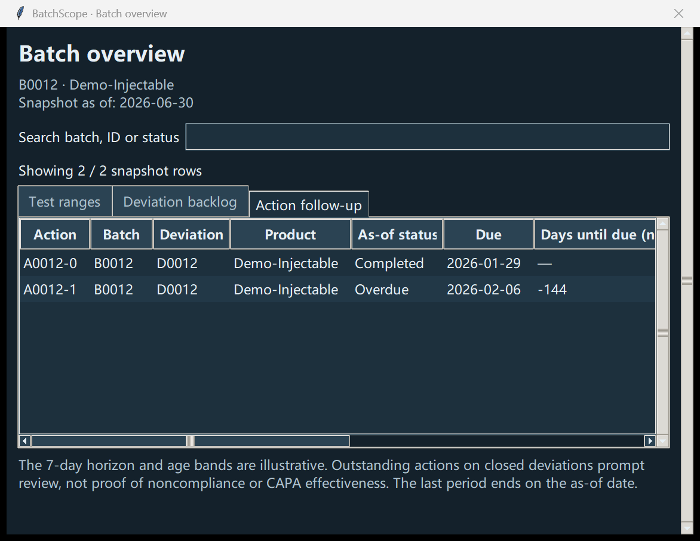

# Quality review workbench / 质量复核工作台

## Why this workflow / 为什么增加这些功能

[ICH Q10 sections 3.2.1, 3.2.2 and 3.2.4](https://database.ich.org/sites/default/files/Q10%20Guideline.pdf) describe quality monitoring, CAPA and management review. From these themes, we infer that transparent follow-up lists and reconciled trends are useful prototype directions. The guideline does not prescribe this app, its age bands or its seven-day horizon. No company interview or production adoption is claimed.

ICH Q10 对质量监测、CAPA 和管理评审的说明启发了本工作台的方向；这是产品设计推断，不是用户调研结论。该指南不规定本程序、积压分段或七天提醒窗口；目前没有企业访谈或实际部署证据。

## Review questions / 复核问题

1. Which outstanding actions are overdue, due today or due in 1–7 days? / 哪些未完成措施已逾期、今天到期或近期到期？
2. Are there outstanding actions linked to closed deviations? / 已关闭偏差是否仍有关联措施需要跟进？
3. Where is open backlog concentrated by age, product and category? / 积压集中在哪些时长、产品与类别？
4. Can opening stock, new openings, closures and ending stock be reconciled? / 期初、开启、关闭与期末能否对账？
5. What measurements, deviations and actions belong to a selected batch at this date? / 指定日期时，选中批次有哪些检验、偏差与措施？

## Rules / 统计口径

An action enters scope only after creation and parent/batch dates. Completion after the as-of date does not remove it from the outstanding queue. A closed parent does not automatically complete an action. The latter is a review prompt, not proof of a procedural violation; site procedures and investigation context are not represented in this data model.

措施需已创建且关联偏差和批次已存在；分析日之后的完成不提前生效。偏差关闭不自动完成措施，此类项只是复核提示，不证明程序违规，模型没有企业 SOP 或调查上下文。

Due today has zero days until due and is not overdue. Due soon is **1–7** days inclusive; day eight belongs to later. Negative days until due indicate lateness for outstanding actions. Completed actions show no remaining-days value. These are time-based categories, not severity, patient risk or staff performance scores.

今天到期不是逾期；近期到期包括第 1 至第 7 天，第 8 天列为更晚到期；未完成措施的负数表示已逾期，已完成措施不显示剩余天数。时间分类不评价严重程度、患者风险或人员绩效。

Age bands are 0–7, 8–30, 31–60 and 61+ days, inclusive and non-overlapping. They count only open deviations. These example boundaries are not regulatory limits or a recommended company SOP.

积压分段互不重叠，涵盖全部未关闭偏差；这些示例边界不是法规标准或推荐企业 SOP。

Monthly counts include same-day openings and closures. First-day closures are counted against opening stock if the deviation existed before that month. Old carryover remains included when the display is capped at 12 months. The final period stops at the actual as-of date; its counts should not be compared as full-month incidence.

同日开启并关闭同时计入两类事件；月初关闭可从期初积压扣除。最多展示 12 个月，但更早积压仍进入期初。最后一期可为不完整月份，不应把它当完整月的发生量比较。

`opening_open + opened_in_period − closed_in_period = ending_open`

`期初积压＋本期开启－本期关闭＝期末积压`

## Demonstration / 示例

The standalone HTML report presents full exports independent of desktop filters. All source values are escaped, and no remote assets or scripts are loaded. SHA-256 fingerprints identify the input bytes; they are not signatures or an audit trail.

HTML 报告展示完整导出，不受桌面筛选影响，转义源值且不加载外部资源或脚本。输入 SHA-256 只用于识别字节，不是签名或审计追踪。

This prototype does not infer root causes, certify CAPA effectiveness, authorize release or reconstruct edit/reopening history. A next useful step is to ask a domain reviewer to work through one batch and document confusion or missing context.

本原型不推断根因、认证 CAPA 有效性、批准放行或重建编辑/重新开启历史。下一步应请业务人员独立复核一个批次，记录不清晰之处与缺少的上下文。
