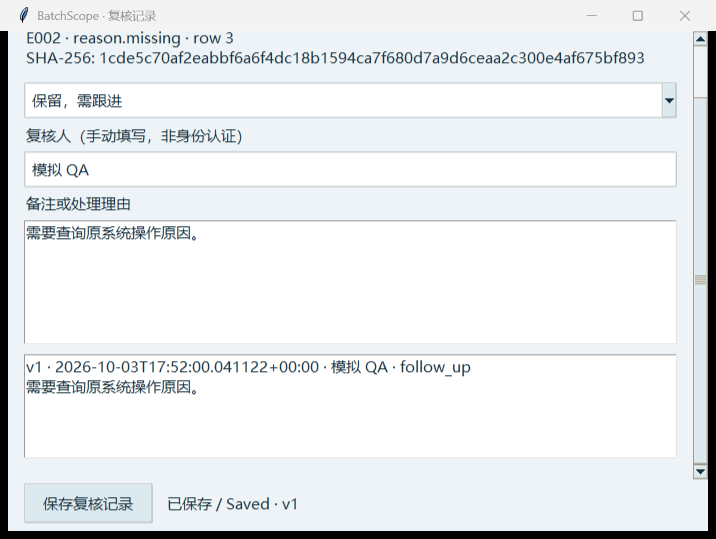

# Simulated role review / 模拟岗位试用（2026-10-04）

This is an AI-run walkthrough of the desktop application, not feedback from a QA, QC or data-integrity professional. It checks observable software behaviour with fictional data; it cannot validate company procedures or regulatory suitability. / 这是 AI 操作真实桌面程序的模拟岗位试用，并非 QA、QC 或数据完整性从业者反馈。测试使用虚构数据，只能验证程序行为。

| Simulated role / 模拟角色 | Task and observed result / 任务与观察 |
|---|---|
| QC reviewer / 检验复核员 | Generated inputs, analysed the 2026-06-30 snapshot and opened a test group. The snapshot reported 22 open deviations and 30 overdue actions. / 生成数据、运行指定日期分析，并打开检验分组。 |
| QA action owner / 质量措施负责人 | Filtered the work queue to 11 outstanding actions linked to closed deviations, opened a linked batch, then compared three dates. Overdue actions changed from 30 to 33 between June and July. A bad date did not replace the completed result. / 筛选、追溯批次、比较日期并测试错误日期恢复。 |
| Data-integrity reviewer / 数据完整性复核员 | Reviewed six findings, saved a follow-up reason, reopened the same source and policy, and exported the full report. Changing the policy isolated the old note; the source CSV hash stayed unchanged. / 保存理由、重开、切换配置并核对完整导出和原文件。 |

One actual UI defect was found: at the allowed 700 × 500 window size, the review-history field was only about 15 pixels high. The note editor now scrolls as a form and keeps **Save review note** visible in a fixed footer. A geometry regression test confirms that the saved history can be reached at that size. / 实际发现的问题：最小窗口下修改历史只剩约 15 像素。现已改为可滚动表单，保存按钮固定可见，并新增小窗口回归测试。

**Verification / 验证：** 67 source tests passed after the fix. The multi-date test initially failed in a read-only sandbox because it could not write its output; it passed when rerun with project write access. The role walkthrough exercised Tkinter windows and generated actual reports. No external user, LIMS export, authenticated reviewer or clean-machine deployment was involved. / 修复后 67 项源码测试通过；首次多日期测试因只读沙箱无法保存输出而失败，恢复项目写入权限后通过。本次没有真实用户、LIMS 导出或独立电脑测试。

**Unverified need / 待验证需求：** a real team's audit export may use different columns, time zones, permissions and review procedures. The desktop audit view currently accepts one documented CSV schema and limits input to 5 MB. The next useful evidence is a blank or fully sanitised export schema plus an independent walkthrough by a QA/data-integrity reviewer. Do not treat this prototype as a validated exception-reporting or electronic-signature system. / 真实企业导出格式、时区、权限和复核流程仍未知；桌面审计窗口有固定格式和 5 MB 上限。下一步需要脱敏字段结构与真人独立操作记录。
