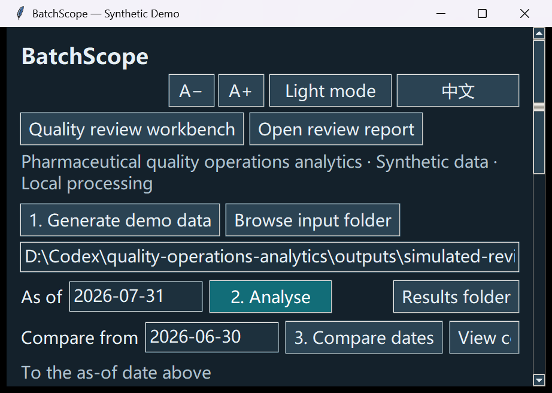
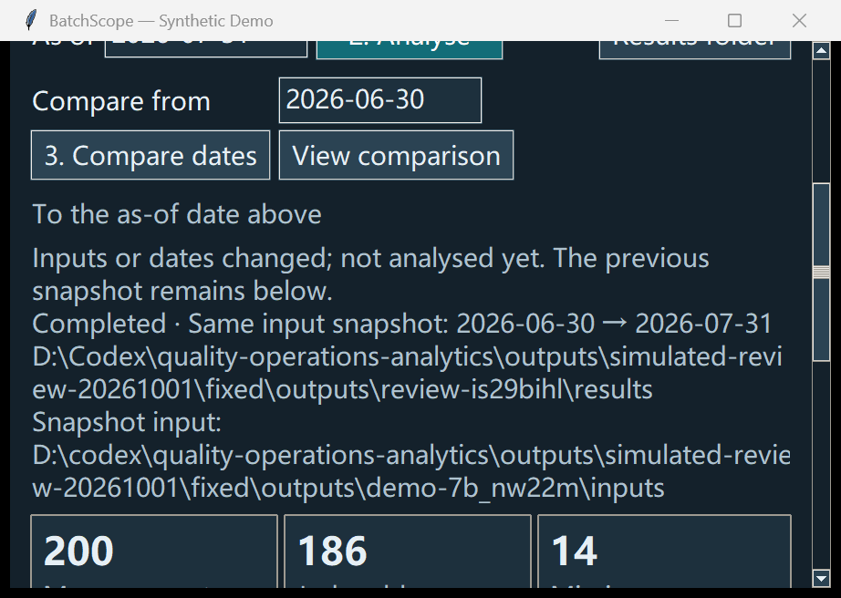

# Scripted usability review / 模拟试用与修复

On 2026-10-01, an AI-driven script exercised native Tkinter buttons, actual background SQL workflows and fictional generated inputs. Error dialogs were intercepted. This is source-mode software review, **not a real teacher/user trial or external adoption evidence**. / 脚本试用真实界面，不代表真实教师或用户认可。

Seven workflow checks passed: empty-result controls, Generate/Analyse example metrics, bad-date recovery, contextual action filtering, filter restoration, no-result search and fixed two-date comparison. / 7 项流程检查通过。

| Observed on alpha.3 / 原问题 | Fix in alpha.4 / 修复 |
|---|---|
| 900×600, English, font 14: comparison-result button text cropped. / 对比结果入口截断 | Date controls wrap into two rows when necessary. / 日期操作自动换行 |
| Generate new inputs while previous reports remained enabled, without an input-change warning. / 新数据与旧快照混淆 | Completed snapshots show the original folder; changed inputs/dates show **not analysed yet**, retaining old metrics and reports. / 原输入与新任务状态明确 |

Two new source regressions verify full date-button labels and previous-snapshot identity. Packaged diagnostics also check these behaviors. Synthetic generation and metric rules remain unchanged. / 新增两项源码回归与对应 EXE 检查，不改数据和指标口径。

Before / 修复前:

After / 修复后:

No human completion times, learning gains or satisfaction were measured. The historical alpha.2 simulated teacher review remains a separate record. / 未测量真人耗时、学习收益或满意度；保留旧模拟评审记录。
