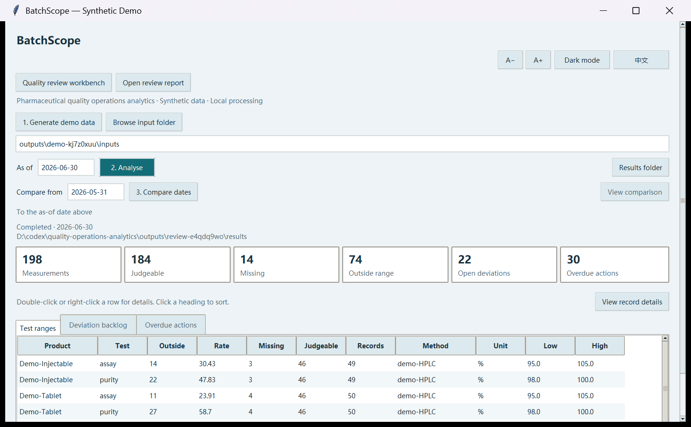
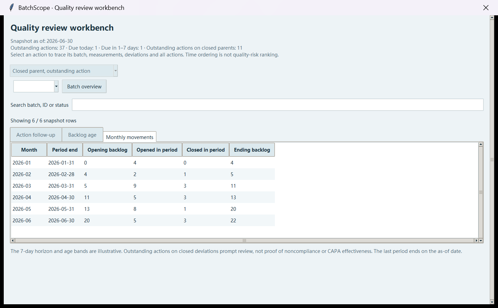

# BatchScope 模拟教师试用反馈

**性质：AI 模拟教师视角评审；不是外部老师反馈，不是独立人工用户测试。**

**后续状态：** v0.5.0-alpha.3 已新增日期提前校验，日期输入错误时保留旧结果，并在积压/月度页隐藏措施筛选。下文保留 v0.5.0-alpha.2 的历史观察；这不是新一轮真实老师试用。

日期：2026-10-01。版本：v0.5.0-alpha.2。对象：药品质量与安全专业的入门教学及作品集展示。使用固定种子 42 的虚构数据。方法：在 Windows 上调用实际 Tk 界面按钮、筛选和窗口，检查结果并截图；阅读已实现的交互与业务口径后，给出教学可用性判断。未测量真人学习效果、完成时间或满意度。

## 教师视角结论

这个原型适合演示“批次—检验—偏差—措施”的数据关系、缺失值处理、历史日期快照和积压对账。作为课堂辅助案例可以开始试用；不能把它当作真实药企 SOP、检验标准、GMP/CSV 认证系统或批次放行工具。是否提升学习效果仍需实际老师和学生验证。

完成 **11 类任务、16 项程序核对**，核对均通过。这里的“通过”表示程序结果符合本次预期，并不表示学生能够独立理解。

## 实际核对结果

| 任务 | 实际观察 | 课堂价值 |
|---|---|---|
| T01 首次打开及无输入分析 | 工作台不可用；无输入启动会显示操作提示 | 学生不必先理解数据目录即可获得提示 |
| T02 生成样例 | 生成四个 CSV 和 SOURCE.json；使用虚构数据 | 可以让全班使用同一可复现案例 |
| T03 单日期分析 | 六月 198 条检验、184 条可判定、14 条缺失、74 条超示例范围、22 条未关闭偏差、30 条逾期措施 | 适合讨论分母及不同记录类型 |
| T04 组内筛选 | 选中注射剂含量检验组：49 条记录，其中 14 条超范围；筛选后完整组仍保留 | 从汇总追溯检验记录、方法、单位与范围 |
| T05 措施跟进 | 默认显示 32/37 条未完成措施；其中 30 条逾期、1 条今天到期、1 条近期到期；已关闭偏差关联的未完成措施为 11 条 | 区分筛选结果、完整队列和跟进提示 |
| T06 批次追踪 | 选中的批次视图包含该批次的检验、偏差与措施，含已完成措施 | 理解一对多关系及关联记录 |
| T07 积压与月度变化 | 分段合计为 22；六月期初 20＋开启 5－关闭 3＝期末 22 | 练习存量与期间活动的区别 |
| T08 日期对比 | 六月→七月：偏差 22→17，逾期措施 30→33；逾期增加由 4 条新增和 1 条完成构成 | 解释净变化，避免只看总数 |
| T09 语言与主题 | 切换后，旧批次与对比窗口保留原分析日期 | 双语教学与快照一致性 |
| T10 日期错误及恢复 | 无效日期 2026-02-30 被拒绝；本次界面结果清空；改回有效日期后可成功重跑 | 验证容错，也暴露演示中断问题 |
| T11 导出核对 | 报告、CSV、SQLite 与哈希存在且一致；原六月导出文件仍保留 | 支持课后复现和数据追踪 |

详细记录见 [EVIDENCE.json](EVIDENCE.json)。这些操作使用源码桌面界面；EXE 的单独验证另见现有发布附件。

## 具体反馈与改进优先级

### P1：错误日期会清空当前界面结果

**直接观察：** 成功分析后输入 2026-02-30，再运行；结果变为 None，工作台按钮禁用。改正日期后可以恢复。之前导出的文件还在，未被删除。

**教学影响（模拟判断）：** 输入失误会打断讲解，让学生以为之前的分析丢失。

**建议：** 启动工作线程前检查日期及日期顺序；无效输入只提示错误，保留上一份有效结果。明确标注“当前显示结果对应的日期”，避免把修改后尚未运行的日期误认为当前快照。

**验收：** 有有效结果时输入错误日期、颠倒对比日期，原指标/工作台/报告仍可访问；错误提示后修正重跑成功。

### P2：先给学生一页学习任务，不要直接让他们看全部表格

**直接观察：** 界面能展示记录和结果，仓库有业务案例；目前没有内置教师讲解流程、答案或学习任务。

**教学影响（模拟判断）：** 初学者可能会“看到数字但不知道要回答什么”。

**建议：** 第一节课仅做三件事：解释缺失值、追踪一个批次、核对一次月度变化。提供一个小任务单。本次已附 [课堂任务单](WORKSHEET.zh-CN.md)，可先由老师选择题目和难度，无需继续增加软件模块。

**验收：** 真实学生在有限指导下能给出答案与记录证据；收集误解，而不是只问“软件好不好用”。

### P2：明确区分单日期分析与两个日期对比

**直接观察：** 主窗口同时显示 As of 与 Compare from；运行分析使用前者，运行对比使用两者。

**教学影响（模拟判断）：** 新手可能不清楚哪个日期作用于哪个按钮。

**建议：** 按操作模式分组，或增加一句“单日期分析仅使用截至日期”。保持窗口内已有的固定快照标注。

**验收：** 让真实试用者指出两种模式用到的日期，再独立完成一次对比。

### P2：把统计口径和业务结论分开教

**直接观察：** 默认队列有 32/37 条；缺失值为 14；超示例范围率的分母是可判定记录。程序已提示示例数据、复核边界、时间排序不代表风险。

**教学影响（模拟判断）：** 仍可能把 32 当总量、把缺失当零、把超范围直接当作正式 OOS 结论，或把偏差关闭当作措施全部完成。

**建议：** 用课堂提问核实理解；在关键指标旁提供简短口径说明。示例中 74/184≈40.22% 是人为教学数据，不是行业异常率。

**验收：** 学生能解释这些数字的分母、筛选和适用边界；无法仅靠背一个百分比通过任务。

### P2：措施筛选的适用范围要更显眼

**直接观察：** 从措施页切换到积压或月度页后，措施筛选框置灰，但仍保留“偏差已关闭、措施未完成”等上一次选项文字。积压与月度表实际展示完整对应数据，不受该措施筛选影响。

**教学影响（模拟判断）：** 学生可能误认为所有标签页都沿用这个筛选。

**建议：** 非措施页隐藏此控件，或标注“仅筛选措施跟进”；不要改变已有积压和月度统计口径。

**验收：** 学生能够指出筛选作用的标签页，并解释为何月度对账与措施筛选数量不同。

### P3：逐步改善长表格的阅读顺序

**直接观察：** 若干记录字段需横向滚动；原始完成日期与快照状态并存。排序、搜索、复制和字号调整可以使用。

**教学影响（模拟判断）：** 长表可能让学生错过原始日期、方法或单位。

**建议：** 后续可提供“课堂简洁列/完整列”预设和简短字段说明。先保留原值和完整导出，不为了界面简洁丢失上下文。

**验收：** 在常见屏幕和字号下，批次编号、快照状态和当前任务所需日期可直接访问；完整字段仍可查看。

## 哪些优点值得保留

- 固定虚构数据和明确的分析日期：方便复现实验。
- NULL 不被转换为零：能教出有意义的数据分析习惯。
- 汇总可追到记录和批次：减少“只有漂亮图表”的问题。
- 净变化与新增、关闭、持续项分开：有助于解释业务流程。
- 中英文、主题及报告导出：兼顾课堂展示和英文作品集。

## 下一次真实老师试用该问什么

建议请一位老师先独立完成任务单，记录必要提示和不清晰术语，再决定是否用于一节课。以下是待调查问题，目前没有答案：

1. 哪一节课程最适合使用这个案例？
2. 学生最容易误读哪个指标或日期？
3. 任务单应保留哪三道题，删去哪几道？
4. 哪个动作需要老师额外解释？
5. 老师是否愿意在下一次课堂再次使用，原因是什么？

未开展真实访谈，没有用户推荐、采用率、学习提升或满意度数据。不得将本模拟报告写成“获得学院老师认可”。

## English reviewer summary

This is an AI-simulated teacher review of BatchScope v0.5.0-alpha.2, supported by programmatic interaction with its native desktop UI. No external teacher participated. Sixteen checks across eleven task categories passed. The expected synthetic metrics, filters, batch links, monthly reconciliation and two-date movements were reproduced. An invalid date is rejected and recovery works, but the currently displayed result is cleared; preserving the last valid result is the main usability recommendation. A short worksheet and clearer distinction between single-date and comparison modes should help classroom trials. No learning outcomes, time savings, adoption or regulatory validation are claimed.
